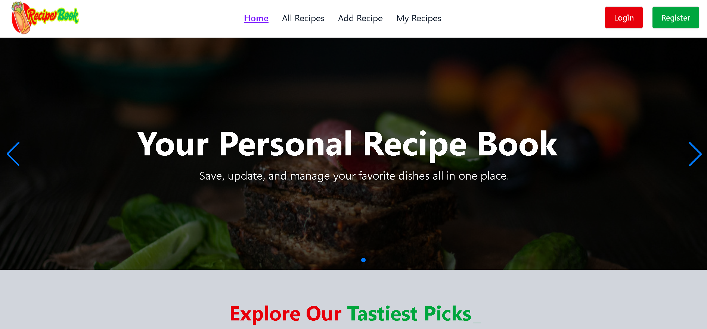

# 🍽️ Recipe Book

🔗 **Live Site:** [https://recipe-book-app-93e6e.web.app/](https://recipe-book-app-93e6e.web.app/)  


---

## 📋 Project Overview
Recipe Book is a full-stack web application where users can discover, share, and manage recipes. It supports adding custom recipes, filtering by cuisine type, and highlights the most popular dishes. All key routes are protected to ensure secure user interaction.

---

## 📷 Screenshot
  
*(Make sure this image exists in `src/assets/` before pushing to GitHub)*

---

## 🔥 Features
- 👩‍🍳 **User-Generated Recipes** — Add recipes with name, cuisine, preparation time, ingredients, and categories.
- ❤️ **Top Recipes** — Displays top 6 most liked recipes dynamically.
- 👁️‍🗨️ **Private Routes & Role-Based Views** — Protected pages like *Add Recipe*, *My Recipes*, and *Recipe Details*.
- 🔍 **Smart Filtering** — Filter recipes by cuisine type using a dropdown.
- 📱 **Responsive Design** — Fully optimized for desktop, tablet, and mobile.

---

## 🛠️ Technologies Used
**Frontend**
- React.js
- React Router DOM
- Tailwind CSS + DaisyUI
- Firebase Authentication
- Lottie React, React Awesome Reveal
- React Hot Toast / Toastify
- Framer Motion

**Backend**
- Node.js + Express.js
- MongoDB (Atlas)
- CORS, Dotenv
- JWT Authentication

---

## 📦 Dependencies & Docs

| Package | Documentation |
|---------|---------------|
| [@tailwindcss/vite](https://www.npmjs.com/package/@tailwindcss/vite) | https://www.npmjs.com/package/@tailwindcss/vite |
| [firebase](https://firebase.google.com/docs) | https://firebase.google.com/docs |
| [framer-motion](https://www.framer.com/motion/) | https://www.framer.com/motion/ |
| [lottie-react](https://www.npmjs.com/package/lottie-react) | https://www.npmjs.com/package/lottie-react |
| [lucide-react](https://lucide.dev/docs/react/) | https://lucide.dev/docs/react/ |
| [react](https://reactjs.org/docs/getting-started.html) | https://reactjs.org/docs/getting-started.html |
| [react-accessible-accordion](https://www.npmjs.com/package/react-accessible-accordion) | https://www.npmjs.com/package/react-accessible-accordion |
| [react-awesome-reveal](https://www.npmjs.com/package/react-awesome-reveal) | https://www.npmjs.com/package/react-awesome-reveal |
| [react-dom](https://reactjs.org/docs/react-dom.html) | https://reactjs.org/docs/react-dom.html |
| [react-helmet-async](https://www.npmjs.com/package/react-helmet-async) | https://www.npmjs.com/package/react-helmet-async |
| [react-hot-toast](https://react-hot-toast.com/docs) | https://react-hot-toast.com/docs |
| [react-icons](https://react-icons.github.io/react-icons/) | https://react-icons.github.io/react-icons/ |
| [react-modal](https://reactcommunity.org/react-modal/) | https://reactcommunity.org/react-modal/ |
| [react-router](https://reactrouter.com/en/main) | https://reactrouter.com/en/main |
| [react-router-dom](https://reactrouter.com/en/main/start/tutorial) | https://reactrouter.com/en/main/start/tutorial |
| [react-simple-typewriter](https://www.npmjs.com/package/react-simple-typewriter) | https://www.npmjs.com/package/react-simple-typewriter |
| [react-slick](https://react-slick.neostack.com/docs/get-started/) | https://react-slick.neostack.com/docs/get-started/ |
| [react-toastify](https://fkhadra.github.io/react-toastify/introduction/) | https://fkhadra.github.io/react-toastify/introduction/ |
| [react-tooltip](https://react-tooltip.com/) | https://react-tooltip.com/ |
| [slick-carousel](https://kenwheeler.github.io/slick/) | https://kenwheeler.github.io/slick/ |
| [sweetalert2](https://sweetalert2.github.io/) | https://sweetalert2.github.io/ |
| [swiper](https://swiperjs.com/react) | https://swiperjs.com/react |
| [tailwindcss](https://tailwindcss.com/docs) | https://tailwindcss.com/docs |

---

## ⚙️ How to Run Locally

### Prerequisites
- Node.js & npm installed
- Firebase config keys
- MongoDB URI

### Steps
```bash
# Clone client
git clone https://github.com/Programming-Hero-Web-Course4/b11a10-client-side-SDNATH-Git
cd b11a10-client-side-SDNATH-Git
npm install

# Create .env file
VITE_FIREBASE_API_KEY=your_firebase_api_key
VITE_FIREBASE_AUTH_DOMAIN=your_firebase_auth_domain
VITE_API_BASE_URL=http://localhost:5000

# Run client
npm run dev
